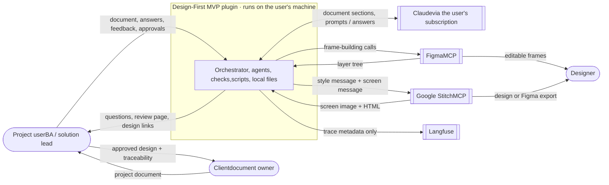
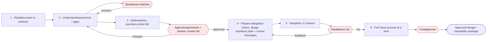

PART 1 · 1.1

## Purpose and scope

The system takes one project document for a **new app**, asks the user everything it needs to know, and produces a design the client can approve. Every requirement, story and screen element can be traced back to a sentence in the document or to one of the user's answers.

### In scope for v1

- One project document per run: PDF, DOCX or Markdown
- New apps only
- Requirement, user stories, Given/When/Then criteria, user journeys, screen list
- Questions to the user in batches, as many as needed
- One style message + one message per screen
- 1–2 sample screens, feedback rounds, then the full UI
- Google Stitch or Figma, chosen by the user
- Local review page, Langfuse tracing
- Internal testing on the team's own Claude subscription, with non-confidential documents

### Out of scope for v1

- Existing apps (v1.1)
- Writing application code
- Jira or Azure DevOps export
- Several users working on one project
- API keys, login, billing, dashboard (v2 SaaS)
- Confidential client documents

PART 1 · 1.2

## Goals

### Business goals

- Cut the time from a client brief to an approved design from days to hours
- Give clients proof: every screen element links back to their own words
- Learn which parts of an AI-enabled SDLC work, before building the full product
- Reuse everything built here in the v2 SaaS product

### Learning goals for the team

- Build and test a real multi-agent system end to end
- Practise grounding, rules + AI checks, tracing and evaluation
- Learn the limits of AI design tools in practice

*Quality goals, written as testable scenarios*

Each goal says what happens, how the system must respond, and how to measure it. These drive the design decisions in later parts.

QG1**Never invent a requirement**

*When*

The Requirement agent writes an item

*Condition*

Any document, including vague ones

*Response*

The item quotes its source sentence, or is marked as an assumption and asked about

*Measure*

0 items whose quote isn't found word for word in the document

QG2**Everything is traceable**

*When*

The full UI is finished

*Condition*

Any project

*Response*

Each criterion links to a screen; each screen links to its stories and sources

*Measure*

Coverage report shows 100% of criteria on a screen, or lists each gap

QG3**Never lose work**

*When*

Claude Code is closed or crashes mid-step

*Condition*

Any step, including mid-build

*Response*

Next `/mvp` resumes at the last finished step

*Measure*

0 lost answers, 0 lost approvals, 0 duplicate screens

QG4**Hidden instructions are never followed**

*When*

A document, Figma file or Stitch output contains instructions

*Condition*

Any agent step

*Response*

Treated as data; no tool runs, nothing is sent out because of it

*Measure*

0 followed instructions across all injection tests

QG5**All screens look like the approved samples**

*When*

The full UI is built after "Go"

*Condition*

Either design tool

*Response*

Colours, fonts, spacing and navigation match the sample tokens

*Measure*

100% token match, or each mismatch flagged in the review

QG6**A non-technical person can answer every question**

*When*

Agents need information

*Condition*

User has no technical background

*Response*

Plain words, "why I'm asking", suggested answers, "suggest for me"

*Measure*

Test users answer without asking what a question means

QG8**Items keep their IDs**

*When*

An agent writes a new version of a record

*Condition*

After answers, comments or reruns

*Response*

Existing items keep their IDs; only new items get new IDs; removed items are marked removed

*Measure*

100% of links (answers, comments, approvals, screens) still resolve

QG7**The design tool can be swapped**

*When*

The user picks Stitch or Figma, or a new tool is added

*Condition*

Same project files

*Response*

Only the adapter changes; agents, checks and files stay the same

*Measure*

No agent or schema change needed to switch tools

PART 1 · 1.3

## Stakeholders

| Who | Role | What they need from the system |
|---|---|---|
| Project user | Runs `/mvp`: a BA, solution lead or presales engineer | Clear questions, a review page that's easy to read, a result they can show the client |
| Client | Owns the document, approves the result | Their requirements understood correctly; proof of where each screen came from |
| Designer | Receives the Figma or Stitch design | Editable, consistent screens built with real components |
| Engineering team (3 owners) | Builds and runs the system | Clear part boundaries, fixed file formats, traces to debug |
| Security and legal reviewer | Checks safety and data use | Where data goes, what each agent can do, how keys are kept |
| Future v2 customers | Agencies and enterprise IT | The same quality, on API keys, with teams and audit |

PART 1 · 1.4

## Constraints

Constraints are things the design must accept, not choose. They explain many of the decisions later in this document.

| Type | Constraint | Effect on the design |
|---|---|---|
| Platform | Runs as a Claude Code plugin on the user's own subscription | No API keys, no Agent SDK calls, no server; everything runs on the user's machine |
| Platform | Sub-agents can't ask the user questions | Only the orchestrator talks to the user; workers return questions |
| Platform | Sub-agents have no enforced output format | Rules checks validate every file after it's written |
| Platform | Usage limits of the Claude subscription | Checks and Figma building must be measured; testers use Max |
| Platform | Sub-agents run in the background by default and can start other sub-agents unless the tool is removed | Orchestrator waits for each agent to finish; no agent has the tool to start agents |
| Platform | A hook that crashes lets the action go ahead; only an explicit "deny" blocks | Guard hook catches every error and returns "deny" |
| Platform | Plugin secrets reach hooks and MCP settings, but not commands run through Bash | The Stitch script reads its key from the OS keychain itself |
| Design tool | Stitch's official SDK is TypeScript only and wraps Stitch's MCP endpoint; monthly generation quota; Google Labs product | One TypeScript script for Stitch; screen budget per project; edit instead of regenerate |
| Design tool | Figma writing needs a Full seat, is in beta (will become paid by usage), about 20 KB per call, no images, custom fonts unclear. Read tools: 200 calls a day and 15 a minute on Professional; write calls exempt | Layout compiled by a script into small code chunks; read back through the write tool; Figma path gated by a test |
| Team | 3 engineers, each owning one area | File formats and the adapter interface agreed first so work runs in parallel |
| Data | Non-confidential documents only in v1 | No client data until terms and client permission are in place |
| Machine | Python 3.11+ for most scripts, Node.js for the Stitch script, poppler for PDF page reading; Windows, macOS or Linux | First-run check tests each one; scripts handle Windows paths, encoding and line endings |

PART 1 · 1.5

## System context

The C4 "context" view: our system as one box, with the people and outside services around it. Each line says what passes between them.

Only one design tool is used per project. The user chooses it in the design step.

PART 1 · 1.6

## Outside connections and trust

Everything the system receives is given a trust level. Untrusted content is treated as data only: it can be read, but it can never decide what the system does.

| Connection | Purpose | We send | We receive | Trust of what we receive |
|---|---|---|---|---|
| User | Input, answers, approvals | Questions, review page | Document, answers, feedback | Document: untrusted Answers: data |
| Claude (subscription) | All AI work | Document sections, instructions, files | Agent outputs | Checked before use |
| Google Stitch (official SDK, via its MCP endpoint) | Generate and edit screens | Style message + screen message only, sent by the Stitch script | Images, HTML export | Untrusted |
| Figma MCP | Build and read frames | Script-compiled code chunks, carried by the frame builder | Layer tree, file content | Untrusted |
| Langfuse | Tracing | Step metadata; no keys, no document text by default | Nothing used by agents | n/a |
| Local files | All records and state | JSON, Markdown, HTML | Same files on resume | Checked on load |
| Plugin code, schemas, skill files | How the system behaves | n/a | n/a | Trusted |
| OS keychain | Stitch key | n/a | Key at run time | Trusted, never logged |

PART 1 · 1.7

## High-level flow

Six stages from document to approved design. The red boxes are where a person takes part. Part 2 will break each stage into its exact steps.

| Stage | Main worker | Produces | Person takes part |
|---|---|---|---|
| 1 · Read | Python reader + AI check | Sections with IDs, section index, image descriptions | No |
| 2 · Understand | Requirement agent + critic | Requirement with quoted sources, assumptions | Answers questions |
| 3 · Define | BA agent | Stories, criteria, journeys, screen list | Approves all of it |
| 4 · Prepare design | Design Prompt agent | Style message, screen messages, sample choice | Chooses tool, answers design questions |
| 5 · Samples | Stitch adapter or Figma frame builder + screen checker | 1–2 checked sample screens | Feedback or "Go" |
| 6 · Full UI | Same adapter + screen checker | All screens, coverage report, package | Final approval |

PART 1 · 1.8

## What goes in, what comes out

### Inputs

- One project document
- The user's answers to questions
- The user's choice of Stitch or Figma
- Feedback on samples and approvals
- Access: Claude subscription, Stitch key, Figma Full seat, Langfuse keys

### Outputs

- Requirement (JSON + readable Markdown), every item with its source
- User stories, criteria, journeys, screen list
- Style message and screen messages, with versions
- Full UI in Stitch or Figma, with links
- Coverage and traceability report
- Decisions log, question and answer history
- Langfuse traces of every step

PART 1 · 1.9

## Assumptions and open questions

### Assumptions (to confirm in week 1)

- The Stitch script can generate, edit and export screens through the official SDK with the team's account; the account type is confirmed
- The Figma account has a Full seat, and the compiled layout path passes the Figma gate (6.10)
- One full project fits within a Max subscription's usage limits
- Langfuse can receive events from plugin hooks
- Python, Node.js and poppler are available on every tester's machine
- The guard hook sees the calling agent and the Figma file key

### Open questions

- Can Figma's web-to-layers tool turn Stitch output into good Figma layers? (an alternative Figma route)
- Which Claude model does each agent use? (bake-off in week 1)
- Langfuse in the cloud or self-hosted?
- What do Stitch's terms say about client data?

*Concept and why · Part 1*

**Why an architecture starts with context, not boxes**

Before deciding how to build, an architect fixes what the system is for, where its edges are, and what it talks to. Without this, teams build parts that don't fit together or solve the wrong problem.

**Quality goals as scenarios**

"It must be reliable" can't be tested. "If Claude Code closes mid-step, the next run resumes with 0 lost answers" can. Every later decision is checked against these scenarios.

**Constraints vs. decisions**

Constraints are given (the subscription, Figma's limits). Decisions are chosen (the state script, the adapter). Writing constraints down explains why decisions look the way they do.

**Trust levels**

Marking every input as trusted or untrusted is the start of the security design. Untrusted content can be read, but it never chooses an action.

**Learn next**

arc42 sections 1–3, the C4 context diagram, quality attribute scenarios, trust boundaries.

Sources for the method: [arc42 + C4 example](https://github.com/milanm/architecture-docs), [RAD-AI: architecture documentation for AI systems](https://arxiv.org/pdf/2603.28735).
