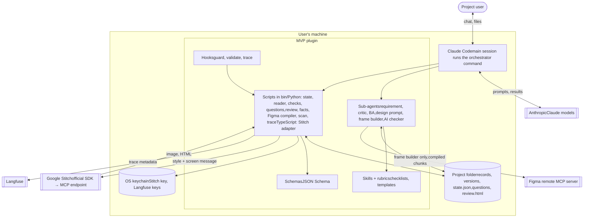
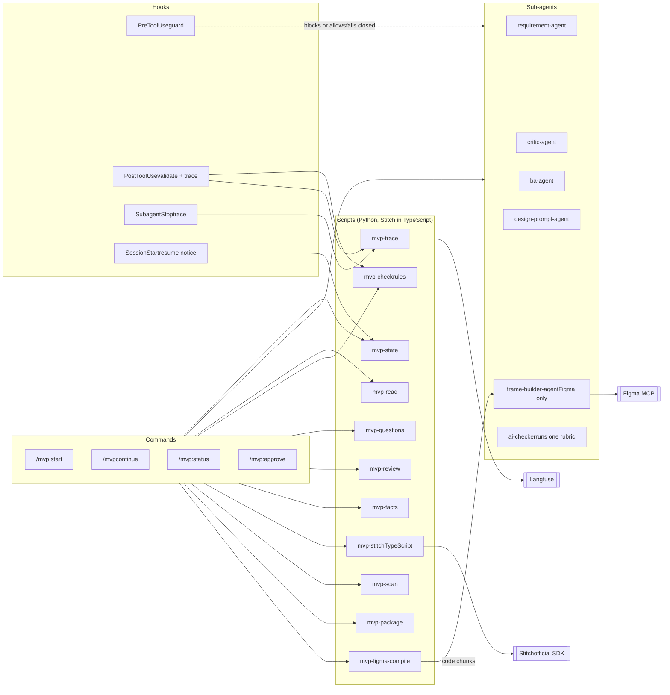
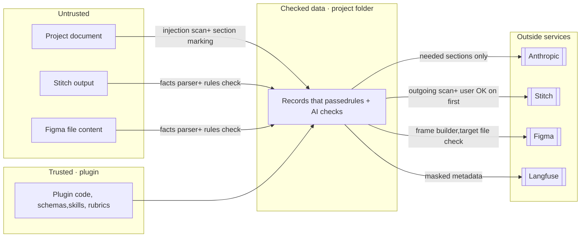

PART 3

## System diagram

The system at three zoom levels: the containers that run on the user's machine, the components inside the plugin, and the boundaries data crosses. It also covers who may do what, where data goes, how parts talk to each other, and what runs where.

### Architecture choices (accepted in revision 2)

- **Stitch is called by one TypeScript script** (`mvp-stitch`) using Google's official SDK, which talks to Stitch's MCP endpoint. Every Stitch call is exact, counted and resumable, and no AI can send anything else to Stitch. The script reads the Stitch key from the OS keychain itself, because plugin secrets are not passed to commands run through Bash.
- **Figma is agent-carried, script-compiled.** Figma's write tool can only be called by an AI, so the frame builder calls it, but the content it sends is compiled by a script from a checked layout file. It may use only Figma's write tool, on the one target file.
- **All other scripts are Python** (reader, state, checks, Figma compiler, questions, review page, tracing).

PART 3 · 3.1

## Containers

The C4 "container" view: the separately running or separately stored parts. Everything inside the dashed box runs on the user's machine.

| Container | What it is | Technology | Owner |
|---|---|---|---|
| Claude Code + orchestrator | Main session running `/mvp` commands; the only part that talks to the user | Claude Code, plugin commands | Platform |
| Sub-agents | AI workers, each in a fresh context with a tool list | Plugin `agents/*.md` | Agents (frame builder: Product) |
| Skills + rubrics | Checklists, templates, gap lists, check rubrics | Plugin `skills/` | Agents |
| Hooks | Guard every tool call, trigger checks, send traces | Plugin `hooks/hooks.json` calling Python | Platform |
| Scripts | Everything exact: state, reading, rules checks, files, Figma compiling, Stitch calls, tracing | Python 3.11+ in plugin `bin/`; one TypeScript script (Node.js) for Stitch | Platform (review page, Figma compiler: Product) |
| Schemas | The format of every record | JSON Schema files | All three agree |
| Project folder | All records, versions, state | Local files | Platform |
| OS keychain | Secrets | Plugin sensitive settings | Platform |

PART 3 · 3.2

## Components inside the plugin

The C4 "component" view. Arrows show who starts or calls whom. Agents never call each other, and scripts never call AI.

| Component | Job | Called by | Reads | Writes |
|---|---|---|---|---|
| mvp-state | Current step, allowed moves, versions, hashes, resume, rebuild | Commands, SessionStart hook | `state.json`, record files | `state.json` |
| mvp-read | Document → sections, index, images | Commands | Original document | `01-document/` |
| mvp-check | Rules checks per record: schema, IDs, links, quotes, coverage, tokens | Commands, PostToolUse hook | Records, schemas | Check results |
| mvp-questions | Build batches, write `questions-bN.html/.md`, extract answers, store the confirmed answer map | Commands | Questions, `questions-bN.md`, answer map | Question files, `answers.vN.json` |
| mvp-review | Build the escaped, script-free review page with confidence and version differences | Commands | All records | `review-vN.html` |
| mvp-facts | Stitch HTML or Figma layer tree → screen facts | Commands | Exports | `facts.json` |
| mvp-stitch | Stitch adapter (TypeScript, official SDK): test, generate, wait, edit, export, count quota; writes `job.json` before waiting | Commands | Messages, keychain | Screen folders, `job.json` |
| mvp-figma-compile | Layout file → Figma code chunks under 20 KB, each with an idempotency key | Commands | Layout file, design system | Chunks for the frame builder |
| mvp-scan | Injection patterns on input; secrets and personal data on output | Commands | Sections, messages | Scan results |
| mvp-trace | Send masked events to Langfuse | Hooks | Hook event, keychain | Langfuse, `run-log.jsonl` |
| mvp-package | Final handoff package | Commands | All records | `package/` |
| ai-checker | One AI check per run, chosen by rubric (4.4). Writes only its issues file; scripts build any record from that output | Commands | Record + rubric | Issues file |

PART 3 · 3.3

## Trust boundaries

A trust boundary is a line where data changes from "we control it" to "we don't". Every crossing has a check.

| Crossing | Risk | Check at the boundary |
|---|---|---|
| Document → records | Hidden instructions; bad conversion | `mvp-scan` patterns + AI classifier; reader rules check; sections marked untrusted |
| Stitch / Figma output → records | Instructions or scripts inside exports; wrong content | Parsed into facts by script only; never shown as live HTML; rules check against messages |
| Records → Stitch / Figma | Secrets, personal data, unrelated content leaving | Messages built only from checked fields; `mvp-scan` for secrets and personal data; user OK on the first message |
| Records → Anthropic | More data than needed | Agents get only the sections and records their step needs |
| Hooks → Langfuse | Keys or document text in logs | Masking; metadata only by default |
| Agent → any tool | An agent tricked into acting | Tool list per agent + PreToolUse guard hook |

PART 3 · 3.4

## Who may do what

The permission matrix. Anything not marked is blocked twice: by the agent's tool list and by the guard hook. The hook knows which agent is calling, because Claude Code passes the agent's type and ID to it. No agent has the tool that starts other agents.

| Component | Read project | Write | Run commands | Network | Stitch | Figma | Ask user |
|---|---|---|---|---|---|---|---|
| Orchestrator (main session) | Yes | Through scripts | Only `mvp-*` scripts | No | Through `mvp-stitch` | No | Yes |
| requirement-agent | `01-document/`, answers | Its own record path only | No | No | No | No | No |
| critic-agent | Document, requirement | `gaps` only | No | No | No | No | No |
| ba-agent | Requirement, answers | Storyset, screen list | No | No | No | No | No |
| design-prompt-agent | Stories, screens, answers, brief, decisions, team library | `06-design/` only | No | No | No | No | No |
| frame-builder-agent | Messages, design system, compiled chunks | Its screen folder only (layout file, layer tree, `job.json`) | No | No | No | Figma write tool only, on the file key in `state.json` | No |
| ai-checker | Record + rubric | Its issues file | No | No | No | No | No |
| Scripts | Yes | Project folder only (team library: `mvp-package` only, with consent) | — | `mvp-stitch`: Stitch · `mvp-trace`: Langfuse · others: none | `mvp-stitch` | No | No |

PART 3 · 3.5

## Where data goes

| Data | Goes to | Why | Protection |
|---|---|---|---|
| Document sections | Anthropic | Agents must read them | Only needed sections; v1 uses non-confidential documents |
| Answers, records | Anthropic | Later agents read them | Same as above |
| Style message + screen messages | Stitch or Figma | To make the design | Built from checked fields; outgoing scan; user OK |
| Screen exports | Back to the machine | Checks and review | Parsed, never run |
| Step metadata | Langfuse | Tracing and debugging | Masked; no document text by default |
| Stitch and Langfuse keys | OS keychain only | Authentication | Never in files, chat or logs |
| Everything else | Stays in the project folder | — | Ignored by git; purge command |

PART 3 · 3.6

## How parts talk to each other

These contracts are fixed in week 1. Each owner can then build their part without waiting for the others.

| Contract | Shape | Between |
|---|---|---|
| Agent result | `{ status: done \| needs_input \| failed, outputs: [paths], questions: [...], notes }` | Every agent → orchestrator |
| State script | `mvp-state next` · `advance <event>` · `status` · `rebuild` → JSON | Commands → state |
| Rules check | `mvp-check <record> <file>` → `{ pass, errors: [{ id, rule, message }] }` | Commands, hooks → checks |
| AI check | Input: record path + rubric name. Output: `{ pass, issues: [{ id, issue, severity }] }` | Commands → ai-checker |
| Design adapter | `generate(screen_id, message_version, reference?)` · `edit(screen_id, change)` · `resume(job)` → `{ screen_version, image, export, facts_path }` | Commands → Stitch script or frame builder |
| Layout file | JSON Schema: frames, auto layout, components, text, sizes; compiled by `mvp-figma-compile` | Frame builder → compiler |
| Answer map | `{ links: [{ answer_id, question_ids }], conflicts, scope_changes }`, confirmed by the user | ai-checker → questions script |
| Screen facts | `{ fields, buttons, texts, colours, fonts, nav }` | Facts parser → screen check |
| Question files | Batch heading, Q id, text, "Why I'm asking", options, `Answer:` line | Questions script ↔ user |
| Trace event | `{ project, step, actor, start, end, result, check, usage }` | Hooks → trace script |

### Dependency rules

- Only the orchestrator starts agents; no agent has the tool to start another
- Scripts never call AI. When a step needs both, the orchestrator runs the AI part and a script does the rest
- AI never moves the state: `mvp-state advance` checks its own conditions and refuses otherwise
- The orchestrator rebuilds its view from `mvp-state status` on every `/mvp`, never from chat memory
- An AI checker writes only its issues file, never a record
- Design tools are reached only through the adapter
- Every record write goes through a rules check before the state moves

PART 3 · 3.7

## What runs where

| Place | Runs | Needs |
|---|---|---|
| Tester's machine (Windows, macOS or Linux) | Claude Code, the plugin, scripts, project folder | Claude Max or Team; Python 3.11+ with: DOCX and PDF converters, JSON Schema validator, HTML parser, keyring, Langfuse client (pinned); Node.js for the Stitch script; poppler for PDF page reading. On Windows: Python launcher, credential manager through keyring |
| Anthropic | Claude models | The tester's Claude subscription |
| Google | Stitch (official SDK → MCP endpoint) | Team's Stitch account (type to confirm) and API key in the OS keychain |
| Figma | Remote MCP server, the target Figma file | Full seat on the team's paid plan; fonts tested in week 1 |
| Langfuse | Trace storage and viewer | Cloud project or self-hosted (open question) |
| Team git repository | Plugin source, private plugin marketplace | Install with Claude Code's plugin commands; pinned versions |

*Concept and why · Part 3*

**Zoom levels (C4)**

Context for the client, containers for the team, components for the person building a part. Each diagram answers one question; mixing them makes all of them unreadable.

**Separation of concerns**

AI thinks, scripts do exact work, hooks guard, files remember. Each part has one job, so each can be tested and replaced alone.

**Trust boundaries**

Security is designed at the lines where data crosses from outside to inside and back. Draw the lines first, then put a check on each crossing.

**Least privilege**

The permission matrix gives each part only what its job needs. A tricked agent with no tools can't do damage.

**Deterministic edges**

Calls to outside services are made by code wherever possible. Code sends exactly what it was given; an AI might add something. Figma's write tool can only be called by an AI, so the AI only carries content that a script compiled.

**Contracts before code**

Fixing the shapes of messages between parts first lets three people build in parallel and join their work without surprises.

**Learn next**

C4 container and component diagrams, data flow diagrams, trust boundaries, least privilege, interface contracts, dependency rules.
