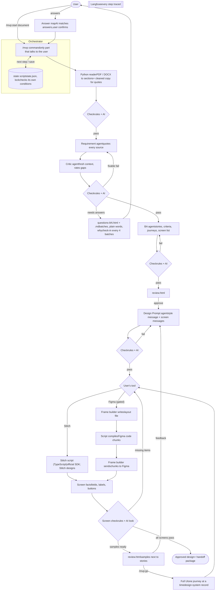
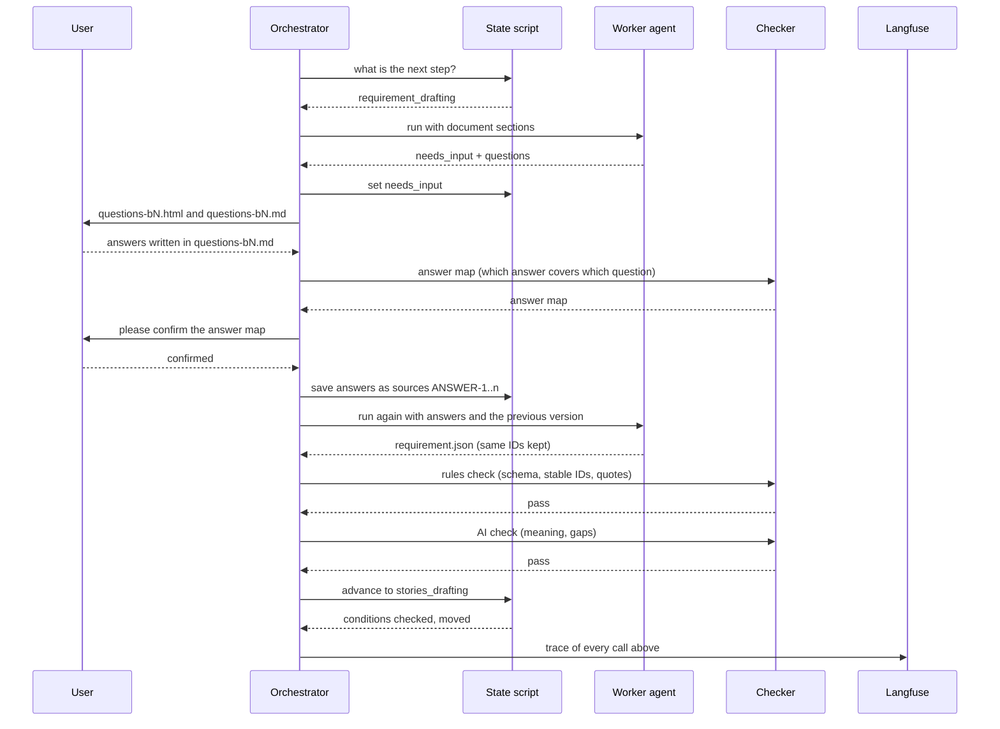

*AI-enabled SDLC · MVP v1*

# Design-First MVP Flow

One project document in; approved requirement, user stories, screen list and full UI design out, in Google Stitch or Figma. Every part shows its flow, how it is checked, and a "concept and why" box you can reuse in other work.

Agent AI worker Script code, no AI decisions Page what people see ⏸ Human answer or approval Check rules + AI

v1 is a multi-agent Claude Code plugin for internal testing on your own subscription, with non-confidential documents. v2 moves to API keys and SaaS. Audit findings are built in; see the [Design-First MVP Audit](https://claude.ai/artifact/9e4yU5DNRUYriQMdbnM6KX).

**Updated to match [MVP AI Architecture](https://claude.ai/artifact/7nMt2vxxvNAoVzBdshZKnM) revision 2**, after the [MVP AI Architecture Audit](https://claude.ai/artifact/2YinQDZJQFGBjTCGkNhNVY). Where this page and the architecture differ in detail, the architecture is the master.

[Decisions](#decisions)[System diagram](#system)[Worker pattern](#pattern)[Parts in detail](#parts)[Question system](#questions)[Stitch and Figma](#tools)[Team plan](#team)[Testing](#testing)[Safety and legal](#safety)[v1.1 and v2](#later)[Concepts](#concepts)

*Decisions*

## What is fixed for v1

| # | Decision |
|---|---|
| M1 | Input is one project document. v1 supports **new apps** only; existing apps come in v1.1 |
| M2 | The `/mvp` command is the orchestrator and the only part that talks to the user. A state script controls the steps and **checks its own conditions** (checks passed, approvals exist) before every move; the orchestrator rebuilds its view from the state on every run |
| M3 | Every output is checked twice: **rules in code** first, then an **AI check** for meaning. Failures are routed **by type**, not simply retried |
| M4 | A Python script reads the document and makes a cleaned copy for quote matching; AI only checks the result and describes images |
| M5 | Every requirement quotes the sentence (or table cell) it came from, matched on cleaned text. Standard features like login are "convention" items you confirm in one question. **IDs never change** between versions |
| M6 | A separate critic agent, in a fresh context, looks for gaps and rates each one: blocking, important or minor |
| M7 | Agents ask **as many questions as needed**, in batches (`questions-bN.html` + `questions-bN.md`), in plain words, each with "why I'm asking". After every 4 batches: "continue, or use suggestions?". An AI step matches answers to questions; you confirm |
| M8 | Requirement approval covers the requirement, the stories and the screen list together |
| M9 | **One style message + one message per screen**; later screens use the approved samples as reference |
| M10 | **Both Google Stitch and Figma**; the user chooses per project. Stitch is called by one **TypeScript script** using Google's official SDK. Figma is built from a layout file compiled by a script, and **gated by a 1–2 week test** with pass marks |
| M11 | 1–2 samples first; feedback rebuilds the style message from the decisions log; `/mvp:go` builds the full UI using a growing design-system record |
| M12 | Fields are checked from the screen's code or Figma layers; vision only checks the look; colours and spacing allowed small tolerances; accessibility rules checked |
| M13 | Langfuse tracing in v1 |
| M14 | Safety baseline: tool lists per agent, **no agent can start agents**, guard hook **blocks on any error**, outgoing check, keys in the keychain, safe review page |
| M15 | Each agent is tested as soon as it's built; end-to-end test after; full evaluation after that, using a small approved API budget only for evaluation |
| M16 | No Jira export in v1. No fixed time target for first screen |
| M17 | Crash safety: job IDs saved before waiting, safe file writes, one session per project, every file versioned |
| M18 | Additions: team library across projects, languages and right-to-left, "web, mobile or both?" asked early, sample data on screens, confidence per item, "what changed" in the review |
| M19 | Project commands: start, continue, status, approve, go, continue after budget pause, reopen, cancel, purge |

*The whole system*

## System diagram

The user talks only to the orchestrator. The state script decides the next step and refuses to move unless checks and approvals are really there. Workers do the AI work. Every result passes a rules check and an AI check before it moves on; a failure is routed by its type (fix and retry, ask the user, or mark for a person). Every step is sent to Langfuse.



*The worker pattern*

## How every agent step runs

Every agent step follows the same pattern. The example below is the Requirement agent needing answers from the user.



*Concept and why*

**Orchestrator and workers**

Workers (sub-agents) start fresh, do one job and return one result. Claude Code removes the question tool from sub-agents, because several workers may run at once and would all interrupt you. Only the orchestrator talks to the human. Workers run in the background, so the orchestrator waits for each to finish, and no worker can start another worker.

**Why it is good design**

One place for human interaction. Every answer is saved and can be cited and audited. Workers can be rerun and tested on their own.

**Reuse it when**

You build any multi-agent system: keep humans talking to one coordinator, and keep workers silent and repeatable.

*Parts in detail*

## Each part: flow, check, concept and why

PART 1

### Orchestrator and state script

Script

The `/mvp` command runs the project. It asks the state script what to do next, starts the right worker, runs the checks, talks to the user, and saves progress. The state script, not the AI, decides the order of steps.

*Flow*

1. User runs `/mvp:start <document>`
2. First run: check the connections to Claude, Stitch, Figma and Langfuse with harmless test calls
3. Take the project lock and rebuild the current picture from the state, not from chat memory *mvp-state status*
4. Ask the state script for the next step *mvp-state next*
5. Start the worker for that step with only the files it needs
6. Run the rules check, then the AI check
7. Passed? — **No:** route by failure type: format error → retry with the errors; vague source → question to the user; unsure check → mark for a person
8. Worker needs answers? — **Yes:** write the question files, wait for the user
9. Ask the state to move forward; the state script checks for itself that checks passed and approvals exist, or refuses *mvp-state advance*
10. `/mvp:status` shows where it is; closing Claude Code and running `/mvp` again resumes there. Other commands: `/mvp:approve`, `/mvp:go`, `/mvp:continue`, `/mvp:reopen`, `/mvp:cancel`, `/mvp:purge`

*Concept and why*

**State machine**

A fixed list of states and allowed moves. The script stores `state.json` with the current step, versions and approvals.

**Why code, not AI**

An AI deciding the order can skip a step, repeat one or forget where it was. Code is exact, testable and can resume after a crash. Because the orchestrator itself is an AI, the state script double-checks every move.

**Rule of thumb**

AI does the thinking inside a step. Code decides which step comes next.

`State machine` `Deterministic control flow` `Idempotency` `Resume`

*Project states*

```
uploaded → reading → requirement_drafting → critic_review ⇄ ⏸ needs_input_req → stories_drafting
→ ⏸ awaiting_requirement_approval → design_setup ⇄ ⏸ needs_input_design → ⏸ awaiting_send_ok
→ samples_generating → ⏸ awaiting_sample_feedback ↺ → full_generating (⇄ ⏸ paused_budget)
→ ⏸ awaiting_final_approval → done
also: failed_input, cancelled · /mvp:reopen goes back a stage and marks later work stale
```

This list matches the master state machine in the architecture (Part 2.2).

PART 2

### Checker: rules + AI

ScriptAgentCheck

Runs after every worker. First a script checks everything that can be checked exactly. Only if that passes does an AI checker, in a fresh context, judge the meaning.

*Flow*

1. **Rules:** file matches its schema (required fields, types)
2. **Rules:** IDs are unique and every link points to something real
3. **Rules:** every quote appears in the cleaned text of its section (or its table cell); IDs unchanged from the previous version
4. **Rules:** coverage: every requirement has a story; every story has a screen
5. All rules pass? — **No:** return the exact errors; don't spend AI on it
6. **AI:** is it clear, specific and testable? Does the quote really support the item? Anything vague or contradictory?
7. Return pass, or a list of issues with item IDs
8. If it failed, what kind of failure? — **Format or own mistake:** retry with the errors (2), then more effort (1) · **Quote not found:** script shows the closest real text · **Client's text is vague:** question to the user · **Checker unsure:** 2 of 3 runs decide, marked for a person

*Concept and why*

**Hybrid validation**

Rules are exact, instant and free, but can't judge meaning. AI can judge meaning but can be wrong and costs usage. Use both, rules first.

**Why a fresh context**

An AI checking its own work in the same conversation tends to approve it. A separate checker is more honest.

**Reuse it when**

Any AI output feeds another step: validate the format with code, then the quality with a separate AI.

`Schema validation` `Deterministic validators` `LLM-as-judge` `Grounding` PART 3

### Document reader

ScriptAI check

A Python script converts the document into clean sections with IDs. AI is used only to check the conversion and to describe images.

*Flow*

1. Save the original file with a version
2. Convert to Markdown: DOCX with mammoth or pandoc; PDF page by page (poppler); remove page headers and footers; join broken words
3. Split by heading; give each section an ID *DOC-3.2*; tables get cell addresses *DOC-3.2/T1/R4*
4. Make a cleaned copy of each section for quote matching: standard quotes, spaces and characters
5. Extract images to files
6. Write a section index: ID, heading, length
7. **Rules:** no empty sections; tables kept; page count matches
8. **AI:** compare a sample of pages with the original; describe each image
9. Scan for hidden instructions; mark those sections as untrusted

*Concept and why*

**Use code for exact jobs**

Converting a file has one right answer. A script does it the same way every time, quickly, without using AI.

**Use AI for judgment**

Is anything lost? What does this sketch show? Those need understanding.

**Chunking and section IDs**

Agents read only the sections they need, and every requirement can point to its exact source.

`Document parsing` `Chunking` `Multimodal model` `Prompt injection protection` PART 4

### Requirement agent + critic agent

Agent⏸ Questions

The Requirement agent turns the document into a clear requirement where every item quotes its source. A separate critic agent then hunts for gaps. Anything unclear becomes a question for the user.

*Flow*

1. Read the section index; open only relevant sections
2. Extract goal, users, scope in and out, business rules, non-functional needs
3. For each item, copy the exact source sentence and its position *"quote": "…", "source": "DOC-3.2"*
4. Mark items as *stated*, *inferred*, *answered* or *convention* (standard features like login); add a confidence (high, medium, low) with a one-line reason
5. On every rerun, keep all existing IDs; only new items get new IDs
6. Critic (fresh context) checks a fixed gap list: every user type, error cases, permissions, data life cycle, vague words, languages; rates each gap blocking, important or minor
7. Turn every gap and assumption into a question
8. ⏸ Questions in batches until nothing important is missing (see Question system)
9. Update the requirement with the answers as sources
10. **Check:** rules + AI (Part 2)

*Concept and why*

**Grounding with quotes**

An AI can invent requirements that sound right. Requiring an exact quote, checked by code on cleaned text, stops that. Stable IDs keep every answer, comment and approval linked.

**Independent critic**

A second agent with a clean memory and a fixed checklist finds more gaps than self-review.

**Ask, don't guess**

A wrong guess at this step multiplies into wrong stories and wrong screens later.

`Grounding / citations` `Hallucination control` `Critic agent` `Human-in-the-loop` `Context engineering` PART 5

### BA agent + screen list

Agent⏸ Requirement approval

Writes the user stories, Given/When/Then criteria and journeys, and the **screen list**: every screen, its states and how screens link together. The user approves all of it together.

*Flow*

1. List user roles and the journeys each one takes
2. Write stories per journey step *As a … I want … so that …*
3. Write criteria per story, including errors and edge cases *Given … When … Then …*
4. Build the screen list: screen, purpose, role, states (empty, loading, error, success), links to other screens, realistic sample data
5. Link each criterion to the screen that shows it
6. **Check:** rules (every requirement has a story, every story has a screen, IDs stable) + AI (criteria testable, nothing beyond scope)
7. Write the review page: requirement, stories and screen list, each item with its source and confidence (low-confidence items first) and **what changed since the last version**
8. ⏸ User comments by item ID in `feedback-rN.md` or chat, approves parts, or approves all with `/mvp:approve`; the approval is recorded

*Concept and why*

**Traceability**

Requirement → story → criterion → screen. Every screen element can be traced back to the document. This is what makes the product different.

**Why approve the screen list**

It decides how many screens get built, the cost, and what "complete" means. Fixing it here is cheap; fixing it after screens exist isn't.

`Traceability` `BDD (Given/When/Then)` `Structured output` `Few-shot examples` PART 6

### Design Prompt agent

Agent⏸ Tool + design questions

Writes **one style message** for the whole project and **one message per screen**. It uses a design skill file with the checklist and templates, and asks the user everything it needs.

*Flow*

1. ⏸ Ask: Google Stitch or Figma? (for Figma, also the target file) Test that connection; save the choice. Changing tool later sends samples back to this step
2. Load the design skill: checklist, style template, screen template, sample rules; check the team library for this client's past design system and answers
3. Mark each checklist item as answered (with source), from the team library, or missing. Asked first: **web, mobile or both, and screen sizes**; also output language and right-to-left, accessibility needs
4. ⏸ Ask the missing items in batches (Question system)
5. Write the **style message**: product summary, roles, colours, fonts, spacing, components, navigation, things to avoid
6. Write one **screen message** per screen from the screen list and its criteria, with realistic sample data in the output language
7. Pick 1–2 samples: the main screen + one form screen
8. **Check:** rules (length limit, every criterion of each screen included, colour contrast, touch-target size) + AI (no contradictions)
9. ⏸ Scan outgoing messages for secrets and personal data; show the first one to the user and wait for OK

*Concept and why*

**Style message + screen messages**

Short messages stay under tool limits, each screen gets full attention, one screen can be redone alone, and a style change happens in one place.

**Meta-prompting**

One AI writes the instructions for another AI tool. The quality of this message decides the quality of the design.

**Skill file**

The checklist and templates are plain text the team can improve without changing code.

`Meta-prompting` `Agent skill` `Prompt templates` `Token budgets` `Elicitation` PART 7

### Design adapters: Stitch and Figma

ScriptFigma builder: Agent

One interface, two tools that work differently. Stitch designs a screen from the messages, called by a TypeScript script using Google's official SDK. For Figma, the frame builder agent writes a layout file, a script compiles it into small Figma code pieces, and the agent sends those pieces unchanged.

*Flow*

1. `generate(screen)` called with the style message + that screen's message
2. If a job for this screen already exists in `job.json` (after a crash), resume it instead of starting again
3. Which tool? — **Stitch:** the TypeScript script sends the messages, saves the job IDs **before** waiting, waits for the result, fetches image + HTML, counts quota · **Figma:** frame builder writes a layout file → script compiles code pieces under 20 KB → frame builder sends each piece, saves the node IDs after each, reads back through the write tool (no daily limit)
4. Turn the result into **screen facts**: list of fields, labels, buttons, texts, states
5. Save image, link, facts and the message version
6. Error or rate limit? — **Yes:** wait and retry; after 3 tries tell the user
7. `edit(screen, change)` for feedback: change the existing screen instead of starting again

*Concept and why*

**Adapter pattern**

The rest of the system calls `generate` and `edit` and never cares which tool is behind them. Adding a third tool later means one new adapter.

**Normalise, then compare**

Stitch gives HTML and Figma gives layers. Converting both into the same "screen facts" lets one checker work for both.

**Code makes what is sent**

Figma's write tool can only be called by an AI, so the AI only carries pieces a script compiled. What reaches Figma is exact and repeatable.

**Save the job before waiting**

If Claude Code closes mid-screen, the saved job IDs let the next run continue the same job instead of making a duplicate.

`Adapter pattern` `MCP` `Tool calling` `Retries with backoff` `Normalisation` PART 8

### Screen checker

ScriptAgentCheck

Checks that each screen has everything its message asked for, and that it matches the approved style.

*Flow*

1. **Rules:** compare screen facts with the screen message: every field, label, button, state present?
2. **Rules:** after "Go", compare colours, fonts, spacing and navigation with the design-system record, allowing small tolerances
3. **Rules:** accessibility: text contrast and touch-target sizes
4. **AI (vision):** does it look right, is the layout clear, anything broken?
5. Anything missing or off-style? — **Yes:** edit that screen with a fix note, at most 2 times, then flag it in the review
6. Update the coverage report: *38/40 criteria visible on a screen*

*Concept and why*

**Code for presence, vision for look**

Vision models miss small labels and sometimes say things are there when they aren't. Reading the screen's code or layers is exact.

**Design tokens**

Colours, fonts and spacing as named values. Comparing tokens is how you prove screens are consistent.

`Multimodal evaluation` `Design tokens` `Coverage check` PART 9

### Samples, feedback and full UI

PageAgent⏸ Feedback or "Go"

The user sees 1–2 samples next to their stories. Feedback becomes decisions; the style message is rebuilt from those decisions. After "Go", the rest of the screens are built one journey at a time using the approved samples as reference.

*Flow*

1. Show samples with their stories, criteria and coverage in `review.html`
2. ⏸ User writes feedback per screen or overall, or "Go"
3. Label each comment: style (all screens), one screen, or requirement change; show the user how each was understood. A requirement change goes back to the Requirement agent and marks the samples out of date
4. Add each change to the **decisions log**
5. Rebuild the style message from the decisions log; update screen messages; show the difference
6. Edit the samples; back to the screen check
7. `/mvp:go`: the approval is recorded; tokens and components from the approved samples become the **design-system record**, which grows as new components appear; build each journey's screens with it
8. ⏸ Final design approval (recorded); package requirement, stories, screen list, design links, messages, decisions and design system; offer to save the design system to the team library

*Concept and why*

**One source of truth**

Patching a prompt round after round piles up contradictions. Rebuilding it from a clean list of decisions keeps it consistent.

**Reference-based generation**

Text alone drifts from screen to screen. Using approved screens as the reference keeps the full UI looking like the samples.

`Iterative refinement` `Agent memory` `Partial regeneration` `Feedback classification` PART 10

### Langfuse tracing

Script

Every step, tool call, check result and question round is recorded in Langfuse, so you can see what each agent did, how long it took and where it failed.

*Flow*

1. Plugin hooks fire at each tool call and when each worker finishes
2. A hook script sends the event to Langfuse: project, step, agent, duration, result, check outcome
3. Keys and document text are masked before sending; metadata only by default
4. One trace per project; one span per step
5. If Langfuse is unreachable, events wait in the local run log and are sent later; the flow never waits
6. Usage numbers come from Claude Code's telemetry export, since hooks don't report usage
7. Week 1 check: the official Langfuse Claude Code integration with a pinned version

*Concept and why*

**Observability**

AI systems fail in quiet ways: a skipped field, a weak question, a slow tool. Traces show exactly where.

**Data minimisation**

Send only what you need to debug. Customer text stays out of logs unless you choose otherwise.

`Agent tracing` `LLM observability` `OpenTelemetry` `Hooks`

*Question system*

## Ask everything the agents need

There is no fixed number of questions. Agents ask until they have what they need for the best result. Questions come in batches so the user is never faced with a wall of text. Each batch groups one topic, and blocking questions always come first. After every 4 batches the user gets a check-in.

*Rules*

1. Collect all questions from the Requirement agent, critic, BA agent or Design Prompt agent; each gap is rated **blocking** (design would be wrong), **important** (a screen or rule would change) or **minor**
2. Remove duplicates and anything the document already answers
3. All standard features (login, password reset…) go into one question: "we assumed these; untick any you don't want"
4. Group by topic; blocking first; one batch at a time
5. Write each question in plain words, with "why I'm asking", suggested answers, and "not sure, suggest for me"
6. Write `questions-bN.html` (easy reading) and `questions-bN.md` (user types answers); each question has its own `### Q-n` heading
7. Read the answers. An AI step matches each answer to the questions it covers (handles "same as Q3" or one answer for several), flags conflicts with the document, and the user **confirms the match**
8. Each confirmed answer becomes a source *ANSWER-12*; new questions can follow
9. Every 4 batches: check-in — Shows how many questions remain and how many are blocking. **Continue** or **use suggestions** for the rest
10. Stop when? — No blocking or important gaps remain, or the user chooses "use suggestions" (at a check-in or any time). Remaining items are shown as low-confidence assumptions in the review

*Example: questions-b2.md*

```
## Batch 2 — Who uses the app

### Q-6. Who approves a leave request?  [blocking]
Why I'm asking: this decides which screens
managers see and what happens after "Submit".
Suggestions:
  (a) The employee's direct manager
  (b) Manager, then HR
  (c) Other: ____
Not sure? Write "suggest".
Answer:

### Q-7. What happens if the manager is on leave?  [important]
Why I'm asking: without this, requests could
get stuck and nobody would see them.
Suggestions:
  (a) Goes to the manager's manager
  (b) Goes to HR
  (c) Waits until the manager is back
Answer:
```

*Concept and why*

**Elicitation**

Good questions are specific, explain why they matter and offer choices. Non-technical people answer faster and more accurately when they can pick from examples.

**Answers as sources**

Every answer is saved and quoted, so the final design can show "this button exists because of ANSWER-6".

**Why a check-in, not a hard limit**

A fixed cap would stop before important questions are asked; no limit at all can loop forever. A check-in with the numbers in front of the user lets them decide.

**Why AI matches answers**

Real answers are messy. A script can't tell that "same as above" answers Q-7, so an AI proposes the match and the user confirms it.

*Stitch and Figma*

## Doing both: the issues and how to handle them

Both tools stay in v1, and the team has paid accounts for both. They still work very differently, so this section covers why Figma is harder, the limits of each tool, what to check first, and who handles each issue.

### Why Figma is harder than Stitch

- **Stitch is a designer; Figma is a canvas.** Stitch takes our message and designs the whole screen itself. Figma's MCP server has no "design this screen" command. It gives an agent tools to create frames, text, auto layout, components and variables one by one.
- **So for Figma, our agent is the designer.** The frame builder agent must decide every box, gap, font size and alignment from the style message and screen message. That is many more decisions and many more tool calls.
- **Small pieces only.** Each write call can return at most about 20 KB, so one screen is built in several steps: page frame, then layout, then each section, then fields.
- **No images yet.** Writing doesn't support images or components that contain images, so logos and photos become placeholders.
- **Fonts must exist in the account.** A font the style message asks for must be uploaded to the Figma account first, or the frame falls back to another font.
- **Beta feature.** Writing to the canvas is in beta. It is free now and will become a usage-based paid feature, so behaviour and cost may change.

### Why Figma is still worth it

- Most client designers and enterprise teams already work in Figma
- Frames built from design tokens are more consistent than generated screens
- Designers can edit the result directly, with real components and auto layout
- Layers give exact screen facts, which makes the field check precise

### How we build Figma screens

- The frame builder writes a **layout file** (frames, auto layout, components, text); a script compiles it into small Figma code pieces under 20 KB; the agent sends each piece unchanged and saves the node IDs
- Reading the result back goes through the write tool, which has no daily limit

### The Figma gate

- A 1–2 week test with pass marks: ≤ 20 write calls per form screen, designer rating ≥ 3.5/5, 100% fields present, fonts render, no read-limit problems, crash resumes cleanly, a 30-screen project fits Max usage
- If it fails: test the other route, where Stitch designs and Figma's own web-to-layers tool turns it into editable layers
- If both fail: Stitch ships first, Figma moves to v1.1
- Stitch's own "export to Figma" isn't available to code, so it isn't an option for automation

*Limits of each tool*

| Limit | Google Stitch | Figma MCP server |
|---|---|---|
| How it makes a screen | Generates the whole screen from text | Agent sends script-compiled code pieces to the write tool |
| How we call it | Google's official SDK, which is **TypeScript only**; it talks to Stitch's MCP endpoint. Our one TypeScript script uses it | Figma's remote MCP server; only the frame builder agent can call its write tool |
| Account needed | Stitch account and API key (confirm the account type; no official paid plan was found online) | Full seat on a paid plan to write outside drafts; Dev seats are read-only (confirm the seat is Full) |
| Usage limits | Monthly generation quota (third-party sources: about 350 standard a month). SDK and MCP calls count against it | Read tools: **200 calls a day and 15 a minute** on Professional. Write tools are exempt from these limits |
| Response size | Not published | About 20 KB per write call |
| Images | Supported in designs | Not supported yet when writing |
| Fonts | Its own font set | Figma's documents disagree on uploaded custom fonts; test it |
| Speed | Generation can be slow; the SDK waits about 5 minutes, then we check again | Several small calls per screen |
| Output we read | Image + HTML/code export | Layer tree (node names, text, properties) |
| Status | Google Labs product; terms and plans may change | Write-to-canvas in beta; will become usage-based paid |
| Cost to Claude usage | Low: one call per screen plus checks | High: many tool calls per screen |

*What to check first (days 1–3)*

| Check | Why | Pass when |
|---|---|---|
| The TypeScript Stitch script, using the official SDK and the key from the keychain, generates 3 screens from our messages | Proves the Stitch path | 3 screens with all fields from their messages; account type confirmed |
| Stitch export gives HTML we can read into screen facts | The field check depends on it | Fields, labels and buttons read correctly |
| Your Stitch plan's monthly quota | A 30-screen project with 2 fix rounds can use 60–90 generations | Quota known and written down |
| Figma seat is Full, and `use_figma` writes to a non-draft file | Dev seats can't write | A frame appears in the team file |
| Frame builder + compiler build 1 form screen from our messages | Proves the Figma path is possible; starts the Figma gate | Screen built with auto layout, all fields, correct fonts, ≤ 20 write calls |
| The guard hook can see the Figma file key | Limits Figma to one file | Calls to other files are blocked |
| Fonts from the style message are in the Figma account | Missing fonts fall back silently | No fallback fonts in the layer tree |
| Claude usage for 1 Figma screen and 1 Stitch screen | Figma uses many more calls | Usage per screen measured on Max |
| Stitch → Figma through Figma's web-to-layers tool | The other Figma route if the gate fails | Editable layers of acceptable quality, or route dropped |
| Stitch and Figma terms for client data | Needed before any real client document | Terms read and noted |

Sources: [Figma MCP server FAQs](https://help.figma.com/hc/en-us/articles/39252411778583-Figma-MCP-server-FAQs), [Figma write to canvas](https://developers.figma.com/docs/figma-mcp-server/write-to-canvas), [Figma MCP rate limits](https://developers.figma.com/docs/figma-mcp-server/rate-limits-access/), [Figma MCP server guide](https://github.com/figma/mcp-server-guide), [Google Stitch SDK](https://github.com/google-labs-code/stitch-sdk), [Stitch plans and limits](https://uxmagic.ai/blog/google-stitch-pricing). Limits change often; confirm them on your own accounts.

*Issues and who handles them*

| Issue | Why it happens | How we handle it | Owner |
|---|---|---|---|
| The tools work differently | Stitch designs from text. Figma's MCP builds frames through code; it has no "design from a prompt" | Same messages for both. The TypeScript Stitch script sends them; for Figma the frame builder writes a layout file, a script compiles it, the agent sends the pieces | Platform (Stitch), Product (Figma) |
| Stitch has no official Python SDK | Google's SDK is TypeScript only | One TypeScript script for Stitch; everything else stays Python | Platform |
| Figma read limits | 200 read calls a day on Professional | Read back through the write tool, which is exempt | Product |
| A crash mid-screen | Claude Code closes while waiting for Stitch or halfway through a Figma frame | Job and node IDs saved first; the next run resumes the same job, no duplicates | Platform + Product |
| Figma seat type | Writing needs a Full seat; a Figma API key alone can read but not draw | You have a paid account; confirm the seat is Full on days 1–3 | Product |
| Figma is beta and will be paid by usage | Write-to-canvas pricing and behaviour may change | Keep the adapter interface so the Figma path can change without touching the rest | Product |
| Stitch monthly quota | Every generation and edit counts, including MCP calls | Screen budget per project; edit instead of regenerate; count usage in Langfuse | Platform |
| Figma response limits | Each MCP response is capped (about 20 KB); images aren't supported; fonts must be available | Build each frame in small pieces; use fonts available in Figma; images as placeholders | Product |
| Stitch limits | Quotas aren't published; generation can be slow; it's a Google Labs product | One screen at a time; job IDs saved before waiting; a screen budget per project; read Stitch's terms | Platform |
| Different outputs | Stitch gives HTML; Figma gives a layer tree | Both converted into the same screen facts; one checker | Platform + Product |
| Different consistency | Stitch can drift between screens; Figma frames are built from tokens | A design-system record from the approved samples that grows during the build; small tolerances; Stitch uses samples as reference if the SDK allows it | Agents |
| Twice the testing | Every design test must run on both tools | Shared test cases; results reported per tool, never averaged | Agents |
| Usage limits | The Figma builder makes many tool calls; that uses more of the Claude subscription | Measure one full project on each tool; testers on Max | All |

*Team plan*

## Three people, both tools

| Owner | Builds |
|---|---|
| Agents | Requirement agent, critic, BA agent, Design Prompt agent and design skill, AI parts of all checks, consistency check, test cases |
| Platform | Plugin and `/mvp` commands, state script (with its own condition checks, lock, resume), guard hook (fails closed), rules checks and schemas, Python reader, TypeScript Stitch script, screen facts from HTML, Langfuse hooks |
| Product | Question files (HTML + MD) and answer-map screen, review page (confidence, "what changed"), Figma frame builder and layout compiler, screen facts from Figma layers, safety of the review page, team library |

Agreed in week 1, before anyone builds: the full folder tree, file formats (schemas) and state format, the adapter interface (`generate`, `edit`, `resume`, screen facts), the layout file format, and the question file format. With these fixed, the three can work in parallel.

| Phase | Estimate | Done when |
|---|---|---|
| 1. Foundations | Weeks 1–2 | The 11 week-1 tests pass (Stitch script, guard hook, scripts on Windows, quote matching, usage); Figma gate started; plugin runs; state script, checker framework, reader and Langfuse hooks work |
| 2. Understand | Weeks 3–4 | Requirement + critic + question batches with check-in and answer map + BA + screen list + review page, each tested on its own. Figma gate decided |
| 3. Design | Weeks 5–6 | Design Prompt agent; Stitch adapter, and Figma if it passed the gate, produce 2 samples that pass the screen check |
| 4. Full flow | Weeks 7–8 | Feedback loop and full UI on both tools; safety items; end-to-end test on 3–5 documents |
| 5. Evaluation | Weeks 9–10 | 20 documents × 3 runs, judges checked against human scores, failure tests |

The estimates are a guide; you said time is not the constraint. The order matters more than the dates.

*Testing*

## Test each agent as it's built

### Every agent, before it's "done"

- At least 10 test inputs, including empty, contradictory, very long, non-English and injected documents
- Rules check and AI check pass on all of them
- 5 real runs reviewed by a person in Langfuse
- Time and usage per run measured

### End to end, after the full flow works

- 3–5 documents through the whole flow on both tools
- Close Claude Code mid-step, including while waiting for Stitch and halfway through a Figma frame; it must resume with no duplicate screens
- Rate limits and usage limits mid-build
- Force the guard hook to crash; the action must be blocked
- Two sessions on one project; the second must be refused
- Edit a question's text; the user must be warned
- No key in chat, files or Langfuse

### Full evaluation, after that

- About 20 documents: 12 real with a reviewed answer, 8 tricky
- 3 runs each; report average and worst
- AI judges compared with about 50 human labels first
- Design results reported separately for Stitch and Figma

### Concept and why

- AI answers vary between runs, so one run proves little
- A judge you haven't checked might be wrong in a consistent way
- Testing each agent early finds problems where they're cheap to fix

*Safety and legal*

## Baseline for v1

### Safety

- Every agent has an explicit tool list; no agent can start other agents; a guard hook blocks running commands, web fetch and writes outside each agent's allowed folders
- The guard hook **blocks on any error** of its own (in Claude Code, a crashing hook would otherwise let the action through)
- One session per project (lock file); files written safely and versioned
- Document, Figma and Stitch content are treated as data, never as instructions
- Outgoing messages built only from checked fields, scanned for secrets and personal data
- Stitch key in the OS keychain through the plugin's sensitive setting
- `review.html` escapes all text, blocks scripts and remote images
- Screen names turned into safe file names; `.agent-mvp/` in `.gitignore`
- MCP servers pinned to exact versions, official sources only

### Legal

- v1 for internal testing with non-confidential documents on your subscription
- Read Stitch's own terms before any customer data
- Turn off Figma's AI content training
- Client permission before their documents go to Anthropic, Google and Figma
- Team or Enterprise Claude plans for customer work

*Next versions*

## v1.1 and v2

### v1.1: existing apps

For projects that add to or change an app that already exists.

- Ask "new or existing app?" at the start
- Read the app's code and style files, read-only
- User uploads screenshots of current screens
- Extract the current look as design tokens; new screens must match it
- List existing screens and features so requirements fit what's there
- No building or running the app

### v2: SaaS on API keys

The same agents, skill, schemas and MCP setup, run through the Agent SDK.

- API keys instead of personal subscriptions
- Dashboard instead of local HTML files
- Postgres instead of local files
- Teams, login, billing
- Customer access stored in a secrets vault

*All concepts used*

## Concept list

`Adapter pattern` `Agent harness` `Agent memory` `Agent skill` `Agent tracing` `BDD (Given/When/Then)` `Chunking` `Context engineering` `Coverage check` `Critic agent` `Data minimisation` `Design tokens` `Deterministic control flow` `Deterministic validators` `Document parsing` `Elicitation` `Evaluation` `Feedback classification` `Few-shot examples` `Grounding / citations` `Guardrails` `Hallucination control` `Hooks` `Human-in-the-loop` `Hybrid validation` `Idempotency` `Iterative refinement` `Least privilege` `LLM-as-judge` `LLM observability` `MCP` `Meta-prompting` `Multi agent system` `Multimodal evaluation` `Multimodal model` `Normalisation` `OpenTelemetry` `Orchestrator and workers` `Partial regeneration` `Prompt injection protection` `Prompt templates` `Reference-based generation` `Retries with backoff` `Schema validation` `Single source of truth` `State machine` `Structured output` `Sub-agents` `Token budgets` `Tool calling` `Traceability` `Fail closed` `Failure routing by type` `Answer map` `Text normalisation` `Stable IDs` `Layout compilation` `Design-system record` `Tolerance bands` `Lock file` `Accessibility (WCAG)` `Cross-project memory`
